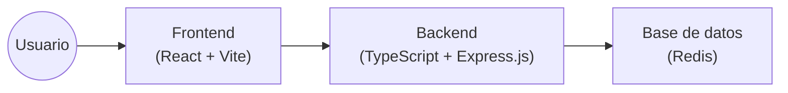
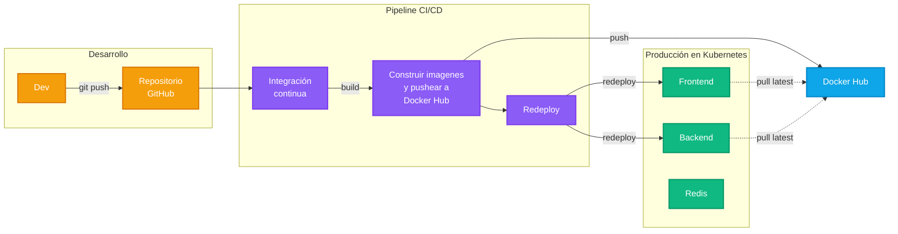

[](https://app.codacy.com/gh/agustinbravop/utn-devops-tp2/dashboard?utm_source=gh&utm_medium=referral&utm_content=&utm_campaign=Badge_grade)


# 🧩 DevOps: Trabajo Práctico 2

Bienvenido al repositorio del trabajo práctico 2 del cursado 2025 de DevOps, realizado por:

- Aldo Omar Andres.
- Agustín Nicolás Bravo Pérez.
- Ariano Miranda.

Links relevantes:

- [Sitio web](http://20.42.47.137:30080).
- [Repositorio](https://github.com/agustinbravop/utn-devops-tp2).
- [Consigna](https://docs.google.com/document/d/17rKVSd9DzsR-YAgXfACUqy_Jh-U3UC44XM7zMcwFb14/edit?tab=t.0).

## ✨ Aplicación: Lista de Tareas

Construimos una simple _todo application_ con los siguientes componentes:

- Una app web desarrollada con React y Vite.
- Un servidor desarrollado con TypeScript y Express.js.
- Una base de datos Redis.

La aplicación permite ver la lista de tareas, crear tareas nuevas y actualizar o eliminar tareas existentes.
Su arquitectura de software es la siguiente:



Flujo de datos:

1. El usuario interactúa con la UI (frontend).
2. React hace peticiones a la API REST (backend).
3. El backend procesa las peticiones y envía peticiones a Redis.
4. Redis responde las peticiones del backend, quien luego responde al frontend.

## 📂 Estructura del Proyecto

```yaml
utn-devops-tp2
├── .github          # Definición de la GitHub Actions
├── backend          # Servidor backend con TypeScript y Express.js
│   ├── package.json
│   └── Dockerfile
├── frontend         # App web frontend con React y Vite
│   ├── src
│   │   └── index.jsx
│   ├── package.json
│   └── Dockerfile
├── docker-compose.yml
└── README.md
```

## 🧑‍💻 Desarrollo

Requisitos para levantar el proyecto:

- Docker.

1. Clonar el repositorio:

   ```bash
   git clone https://github.com/agustinbravop/utn-devops-tp2.git
   cd utn-devops-tp2
   ```

2. Construir y ejecutar la aplicación usando Docker Compose:

   ```bash
   docker compose up
   ```

3. Visitar la UI en `http://localhost:3000` y la API en `http://localhost:3001`.

Se pueden definir las siguientes variables de entorno:

- `frontend/.env`:

  ```
  VITE_API_URL=http://localhost:3001/api
  ```

- `backend/.env`:

  ```
  REDIS_URL=redis://localhost:6379
  PORT=80
  ```

## 🚀 Despliegue (TP 1)

Se tiene una GitHub Action para el despliegue.
Esta GitHub Action requiere los siguientes GitHub Actions Repository Secrets:

```
DOCKERHUB_USERNAME=
DOCKERHUB_TOKEN=
```

Pasos de un despliegue al hacer un `git push`:

1. GitHub Actions ejecuta todos los pasos de integración continua.
2. GitHub Actions construye las imágenes de contenedores y las publica en Docker Hub.
3. PENDIENTE: GitHub Actions notifica al cluster de Kubernetes para redesplegar los servicios, lo cual descarga la imagen nueva de Docker Hub.



## 🏗️ Infraestructura

Se utiliza Microsoft Azure para desplegar la aplicación en un cluster de Kubernetes.
Para respetar la consigna, en lugar de utilizar Azure Kubernetes Service, vamos a instalar k3s en una máquina virtual.
Existen recursos que se deben crear manualmente mediante la CLI de Azure:

```bash
# Previamente se debe haber instalado Azure CLI.
# Ver: https://learn.microsoft.com/en-us/cli/azure/install-azure-cli.
#     brew install azure-cli

# Iniciar sesión con el correo académico y elegir la suscripción "Azure para estudiantes".
az login

# Registrarse en proveedores de Azure que "Azure para estudiantes" no da por defecto.
export RESOURCE_GROUP="utn-devops-tp2"
export LOCATION="eastus"
export SERVER_VM="k3s-server"
export AGENT_VM="k3s-agent"

# Crear un Resource Group para agrupar todos los recursos a crear.
az group create --name $RESOURCE_GROUP --location $LOCATION

# Crear máquinas virtuales (un server y un agent según la arquitectura de k3s).
az vm create \
  --resource-group $RESOURCE_GROUP \
  --name $SERVER_VM \
  --image Ubuntu2404 \
  --size Standard_B2s \
  --admin-username azureuser \
  --generate-ssh-keys
az vm create \
  --resource-group $RESOURCE_GROUP \
  --name $AGENT_VM \
  --image Ubuntu2404 \
  --size Standard_B2s \
  --admin-username azureuser \
  --generate-ssh-keys

# Abrir puertos para el frontend, el redis insight, la API de Kubernetes y el supervisor de k3s.
az vm open-port --resource-group $RESOURCE_GROUP --name $SERVER_VM --port 6443,10250
az vm open-port --resource-group $RESOURCE_GROUP --name $AGENT_VM --port 30080,30540,6443,10250

# Instalar k3s en el server (--tls-san se usa para permitir el acceso mediante la IP pública).
SERVER_PUBLIC_IP=$(az vm show --name $SERVER_VM --resource-group $RESOURCE_GROUP --show-details --query "publicIps" --output tsv)
az vm run-command invoke \
    --resource-group $RESOURCE_GROUP \
    --name $SERVER_VM \
    --command-id RunShellScript \
    --scripts "curl -sfL https://get.k3s.io | INSTALL_K3S_EXEC='server --tls-san ${SERVER_PUBLIC_IP}' sh -"

# Obtener el token del server (lo necesita el agent).
K3S_TOKEN=$(az vm run-command invoke \
    --resource-group $RESOURCE_GROUP \
    --name $SERVER_VM \
    --command-id RunShellScript \
    --scripts "sudo cat /var/lib/rancher/k3s/server/node-token" \
    --query "value[0].message" \
    --output tsv \
    | head -n -3 | tail -n +3) # Quedarse solo con stdout

SERVER_PRIVATE_IP=$(az vm show --name $SERVER_VM --resource-group $RESOURCE_GROUP --show-details --query "privateIps" --output tsv)

# Instalar k3s en el agent.
az vm run-command invoke \
    --resource-group $RESOURCE_GROUP \
    --name $AGENT_VM \
    --command-id RunShellScript \
    --scripts "curl -sfL https://get.k3s.io | K3S_URL=https://$SERVER_PRIVATE_IP:6443 K3S_TOKEN=$K3S_TOKEN sh -"
```

Una vez creadas las máquinas virtuales e instalado k3s, necesitamos conectarnos al cluster de Kubernetes:

```bash
# Previamente se debe haber instalado `kubectl`, la CLI de Kubernetes.
# Ver: https://kubernetes.io/docs/tasks/tools/#kubectl.
#     brew install kubectl

# Obtener el archivo kubeconfig del server (asociado al superusuario admin).
az vm run-command invoke \
    --resource-group $RESOURCE_GROUP \
    --name $SERVER_VM \
    --command-id RunShellScript \
    --scripts "sudo cat /etc/rancher/k3s/k3s.yaml | sudo base64" \
    --query "value[0].message" \
    --output tsv \
    | head -n -3 \
    | tail -n +3 \
    | base64 --decode \
    | sed "s/127.0.0.1/$SERVER_PUBLIC_IP/" > kubeconfig.yaml

# Probar la conexión al cluster recién creado.
export KUBECONFIG=kubeconfig.yaml
kubectl get nodes
```

Para eliminar todos los recursos creados:

```bash
az group delete --name $RESOURCE_GROUP --yes
```

## 🚀 Despliegue

En la carpeta `/k8s` se definen manifiestos de recursos de Kubernetes a desplegar.

## ⚒️ Tareas Pendientes

Esta lista NO es exhaustiva!

- [x] Instalar un cluster de Kubernetes con k3s en Microsoft Azure.
- [ ] Implementar despliegue continuo de la aplicación base.
- [ ] Exponer una acción que genere carga controlada.
- [x] Desplegar los servicios en Pods (conviene utilizar un Deployment).
- [x] Desplegar un servicio o ingress para exponer a la web.
- [ ] Configurar alta disponibilidad para que se levanten nuevos nodos conforme aumenta la carga de la app.
- [ ] Emitir logs structurados en cada servicio de la app.
- [ ] Implementar OpenTelemetry para trazas.
- [ ] Implementar Prometheus para métricas.
- [ ] En las métricas, tener al menos un indicador de contenedor y un indicador de la aplicación.
- [ ] Implementar Grafana para visualización con gráficos y paneles.
- [ ] Opcional: implementar IaC con Terraform para aprovisionar un cluster de Kubernetes.
- [ ] Opcional: agregar un servicio extra a la app para analizar trazas más complejas.
- [ ] Opcional: exponar la aplicación en un dominio (evitando así la URL HTTP cruda).
