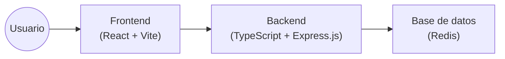

[](https://app.codacy.com/gh/agustinbravop/utn-devops-tp2/dashboard?utm_source=gh&utm_medium=referral&utm_content=&utm_campaign=Badge_grade)


# 🧩 DevOps: Trabajo Práctico 2

Bienvenido al repositorio del trabajo práctico 2 del cursado 2025 de DevOps, realizado por:

- Aldo Omar Andres.
- Agustín Nicolás Bravo Pérez.
- Ariano Miranda.

Links relevantes:

- [Sitio web](https://frontend-production-842c.up.railway.app/).
- [Railway](https://railway.com/project/8a1229ac-af24-48f2-b711-544234bb788b/service/1dc4995f-f778-4f16-9999-ef4b26b8d356/variables?environmentId=81679781-80b7-40e0-8b3d-4e992e4dbd8e).
- [Repositorio](https://github.com/agustinbravop/utn-devops-tp2).
- [Presentación](https://docs.google.com/presentation/d/1Oeib-6iJBH1CDKIbkvpxfdh1EuLlGJWqte_1BYEEv3M/edit).
- [Consigna](https://docs.google.com/document/d/1t88Qv7iCp90YzHOi2W8MfY7bfFoTcjVz1UkCZPzs84c/edit?tab=t.0).

## ✨ Aplicación: Lista de Tareas

Construimos una simple _todo application_ con los siguientes componentes:

- Una app web desarrollada con React y Vite.
- Un servidor desarrollado con TypeScript y Express.js.
- Una base de datos Redis.

La aplicación permite ver la lista de tareas, crear tareas nuevas y actualizar o eliminar tareas existentes.
Su arquitectura de software es la siguiente:



Flujo de datos:

1. El usuario interactúa con la UI (frontend).
2. React envía peticiones a la API REST (backend).
3. El backend procesa las peticiones y envía peticiones a Redis.
4. Redis responde las peticiones del backend, quien luego responde al frontend.

## 📂 Estructura del Proyecto

```yaml
devops-practice
├── .github          # Definición de la GitHub Action
├── backend          # Servidor backend con TypeScript y Express.js
│   ├── package.json
│   └── Dockerfile
├── frontend         # App web frontend con React y Vite
│   ├── src
│   │   └── index.jsx
│   ├── package.json
│   └── Dockerfile
├── docker-compose.yml
└── README.md
```

## 🧑‍💻 Desarrollo

Requisitos para levantar el proyecto:

- Docker.

1. Clonar el repositorio:

   ```bash
   git clone https://github.com/agustinbravop/utn-devops-tp2.git
   cd devops-practice
   ```

2. Construir y ejecutar la aplicación usando Docker Compose:

   ```bash
   docker compose up --build
   ```

3. Visitar la UI en `http://localhost:3000` y la API en `http://localhost:3001`.

Se pueden definir las siguientes variables de entorno:

- `frontend/.env`:

  ```
  VITE_API_URL=http://localhost:3001/api
  ```

- `backend/.env`:

  ```
  REDIS_URL=redis://localhost:6379
  PORT=80
  ```

## 🚀 Despliegue

Se utiliza [Railway](https://railway.com) para desplegar la aplicación.
Se creó un proyecto `devops-practice`.

Con los siguientes comandos interactivos se crean tres servicios `frontend`, `backend` y `redis`:

```bash
railway login
railway link

railway add -s backend \
   -i agustinbravop/devops-practice-backend:latest \
   -v "REDIS_URL=redis://redis:6379?family=6" \
   -v "PORT=80"
```

Es necesario ir manualmente al servicio `backend` y generar una URL para habilitarlo al público.
Esa URL `https://backend-production-ced8.up.railway.app` luego se pone en el paso `build-frontend` de la GitHub Action como el argumento `VITE_API_URL` agregando un `/api` al final.
Esto es necesario porque Vite compila la aplicación al momento de construir la imagen y no procesa variables de entorno en tiempo de ejecución.
Existen workarounds para esto pero en este caso se prefirió mantener una solución simple.

```bash
railway add -s frontend \
   -i agustinbravop/devops-practice-frontend:latest

railway add -s redis \
   -i redis:7-alpine
```

Luego se necesita manualmente habilitar al público los servicios `frontend` y `backend`.
También es necesario en ambos servicios habilitar los redespliegues automáticos cuando se actualiza la imagen con etiqueta `latest`.
Esto no resultó simple de automatizar, demostrando un inconveniente de Railway: prioriza la experiencia de la GUI por sobre la CLI.

Se tiene una GitHub Action para el despliegue.
Esta GitHub Action requiere las siguientes variables y secrets:

```
DOCKERHUB_USERNAME=
DOCKERHUB_TOKEN=
RAILWAY_TOKEN=
```

Pasos de un despliegue al hacer un `git push`:

1. GitHub Actions ejecuta todos los pasos de integración continua.
2. GitHub Actions construye las imágenes de contenedores y las publica en Docker Hub.
3. GitHub Actions notifica a Railway para redesplegar los servicios, lo cual descarga la imagen nueva de Docker Hub.


## ⚒️ Tareas Pendientes

Esta lista NO es exhaustiva!

- [ ] Corregir el despliegue continuo de la aplicación base.
- [ ] Exponer una acción que genere carga controlada.
- [ ] Instalar un cluster de Kubernetes con k3s.
- [ ] Desplegar la app y Redis en Pods (utilizar un Deployment).
- [ ] Desplegar un servicio o ingress para exponer a la web. 
- [ ] Configurar alta disponibilidad para que se levanten nuevos nodos conforme aumenta la carga de la app.
- [ ] Emitir logs structurados en cada servicio de la app.
- [ ] Implementar OpenTelemetry para trazas.
- [ ] Implementar Prometheus para métricas.
- [ ] En las métricas, tener al menos un indicador de contenedor y un indicador de la aplicación
- [ ] Implementar Grafana para visualización con gráficos y paneles.
